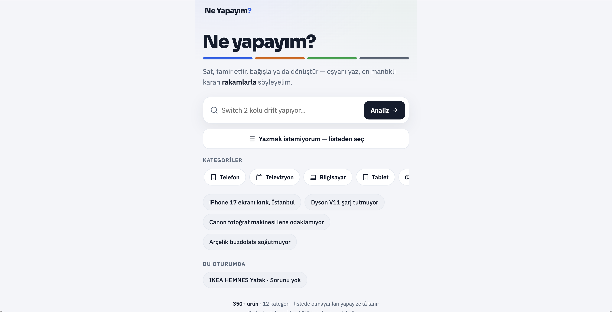
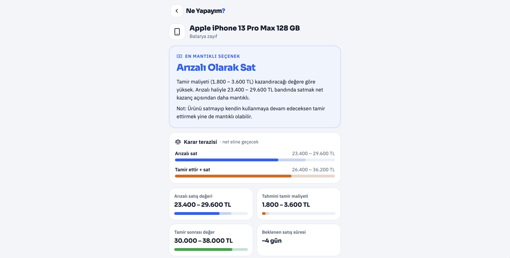
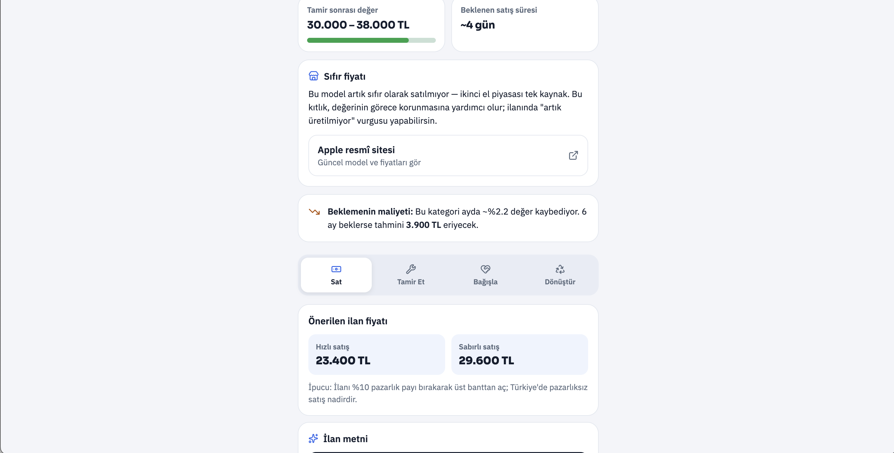

# Ne Yapayım? ♻️

**Ne Yapayım?** is an AI-powered web application that helps users decide what to do with unwanted household items.

The application supports users in choosing whether to **sell, repair, donate, or recycle** an item by combining practical recommendations with estimated item value and repair-related decision logic.

## 🌐 Live Demo

https://ne-yapayim-app.vercel.app

## ✨ Features

- Helps users decide what to do with unwanted items
- Provides sell, repair, donate, and recycle options
- Simple category, brand, and model selection flow
- Practical recommendation page
- Clean and responsive user interface
- Built as a web-based decision support tool

## 🛠️ Built With

- React
- TypeScript
- Vite
- Tailwind CSS
- Vercel

## 🚀 Future Improvements

- AI-powered resale price estimation
- Repair cost estimation by model and fault type
- Marketplace search integrations
- Nearby repair, donation, and recycling location suggestions
- More product categories
- User search history and analytics

## 💻 Installation

```bash
npm install
npm run dev
```

## 📦 Build

```bash
npm run build
```

## 👤 Author

**Basar Acar**  
Management Student  
University of Nottingham

## 📸 Screenshots

### Home



---

### Recommendation



---

### Valuation



---

### Marketplace Integration


